# Aplicación en Javascript


## Pensamiento Creativo con IA
Demostrar la capacidad de aplicar el pensamiento creativo —aumentado mediante el uso de herramientas de Inteligencia Artificial (IA)— para resolver, optimizar y comunicar una solución novedosa a un desafío específico en el estudio o desarrollo con Javascript.

---

## 🧩 Fase 1 — Identificación y pensamiento divergente
*Elige un concepto que sea difícil para ti de Javascript (funciones, promesas, arreglos, etc.). Pide a la IA soluciones que combinen este concepto con un tema no relacionado (música, arte, deportes) para crear un snippet único.*

### Concepto difícil elegido:
Clases en JavaScript

### Enfoque creativo solicitado a la IA:
Combinar este concepto con un tema no relacionado para generar un snippet único y memorable.

### Tema seleccionado:
Clases en JavaScript explicadas con League of Legends como si la IA fuera un coach del juego.

---

## 🧪 Fase 2 — Desarrollo y desafío del sesgo
*Escoge la idea más original. Pide a la IA que te sugiera una solución que rompa con la práctica estándar (p.ej: resolver un problema de array sin usar map() o usar callbacks en lugar de async/await en un escenario específico). Crea el código basado en este enfoque "prohibido".*

### Idea elegida:
La representación de campeones y habilidades usando clases en JS pero pidiendo a la IA que propusiera una solución que rompa con la práctica estándar.

### Regla “prohibida” aplicada:
Crear clases sin usar objetos tradicionales para almacenar propiedades, reemplazándolos con arreglos o habilidades creadas dinámicamente.

### PROMPT #1: 
_Quiero que me expliques el tema de Clases específicamente en el contexto de JS como si tú fueras un coach de League of Legends es decir relacionado a los conceptos del juego, conceptos dominados por los jugadores en general la idea es comprender el tema mediante algo que me guste. Sugiere además soluciones en tus ejemplos que rompan con la práctica estándar como cuando en Python no se usan diccionarios sino arrays puro pero para Javascript. Explícalo con palabras sencillas_

### Respuesta de CHATGPT:
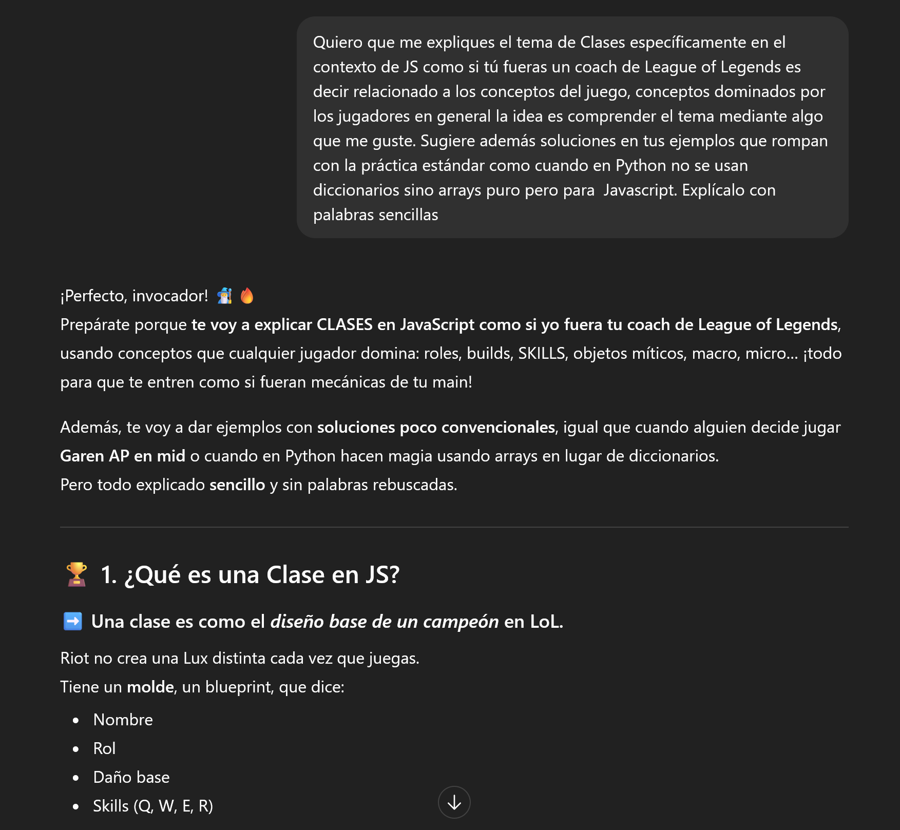

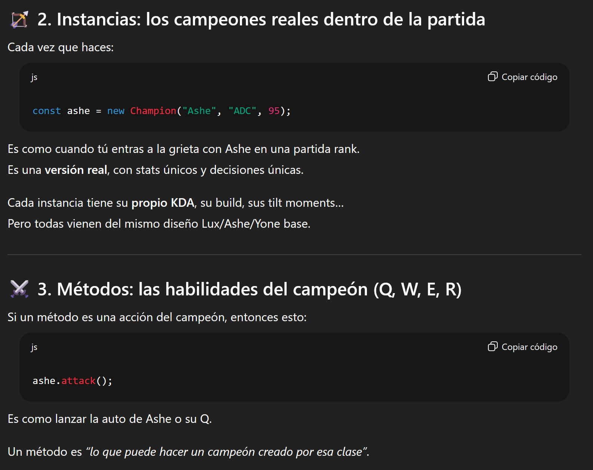
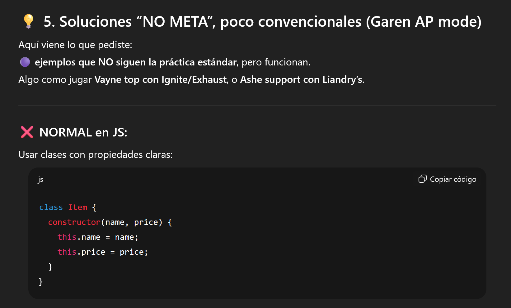
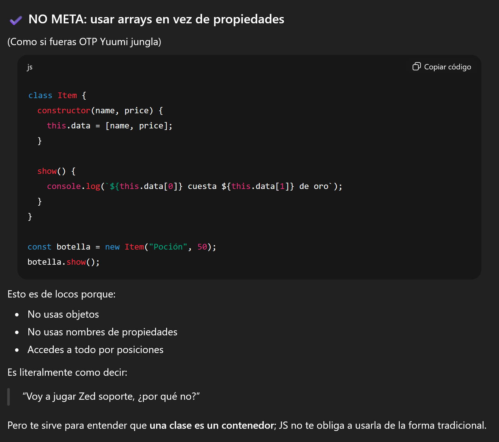
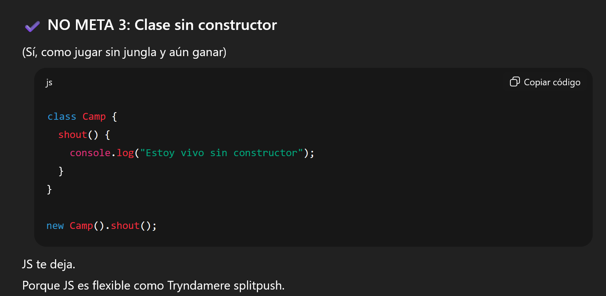
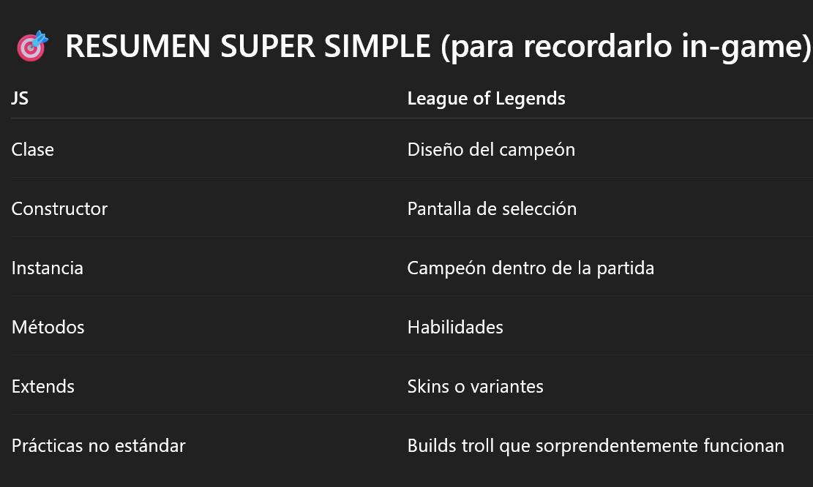

### PROMPT #2: 
_Crea un código con lo anteriormente explicado en JS_

### Respuesta de CHATGPT:

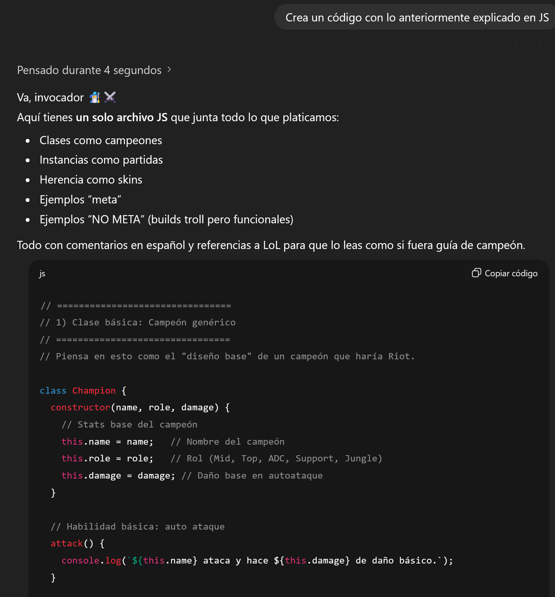
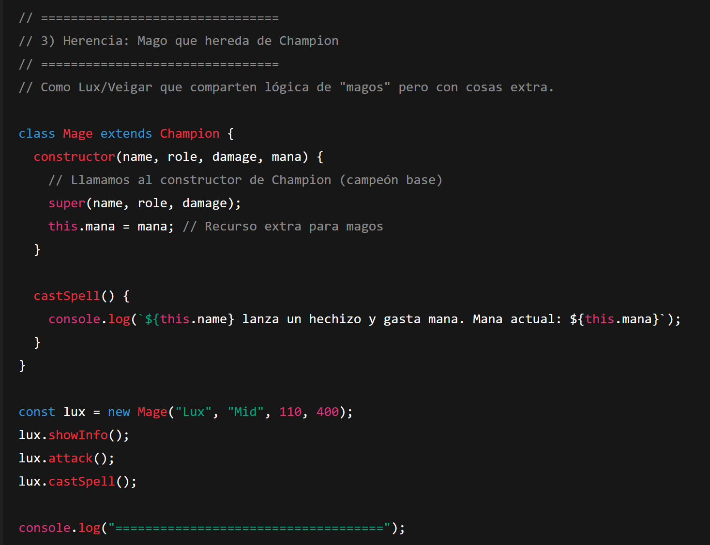
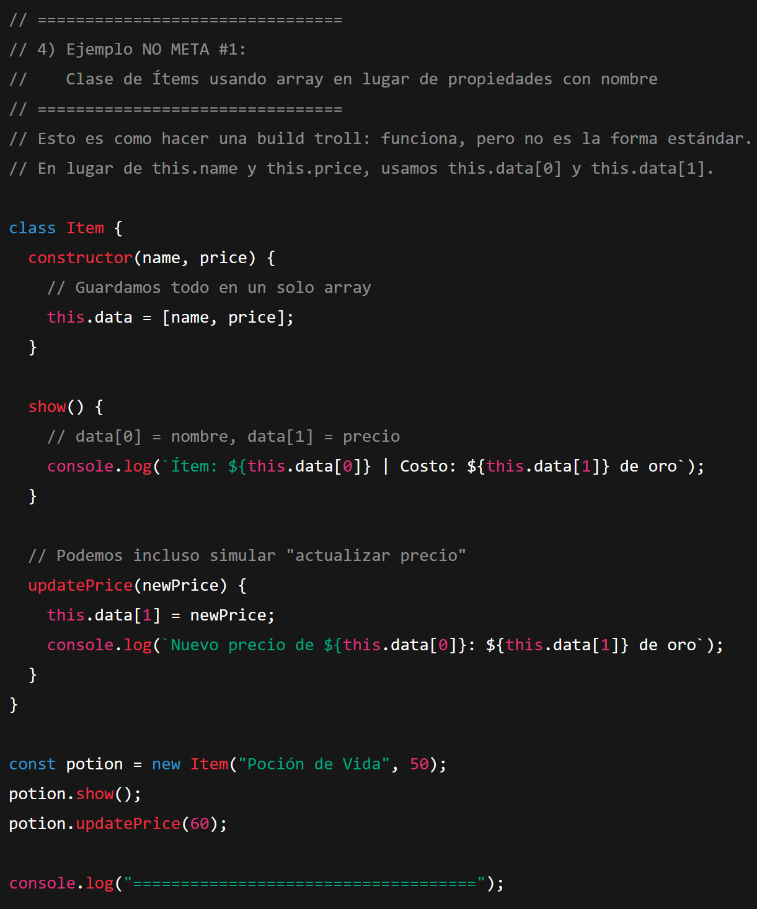

#### Código completo generado:

```js
// ================================
// 1) Clase básica: Campeón genérico
// ================================
// Piensa en esto como el "diseño base" de un campeón que haría Riot.

class Champion {
  constructor(name, role, damage) {
    // Stats base del campeón
    this.name = name;   // Nombre del campeón
    this.role = role;   // Rol (Mid, Top, ADC, Support, Jungle)
    this.damage = damage; // Daño base en autoataque
  }

  // Habilidad básica: auto ataque
  attack() {
    console.log(`${this.name} ataca y hace ${this.damage} de daño básico.`);
  }

  // Método para mostrar info del campeón
  showInfo() {
    console.log(`Campeón: ${this.name} | Rol: ${this.role} | Daño: ${this.damage}`);
  }
}

// ================================
// 2) Instancias: campeones en la grieta
// ================================
// Cada 'new Champion(...)' es como entrar a una partida con ese campeón.

const ashe = new Champion("Ashe", "ADC", 95);
const garen = new Champion("Garen", "Top", 120);

ashe.showInfo();   // Ashe en partida
ashe.attack();

garen.showInfo();  // Garen en partida
garen.attack();

console.log("====================================");

// ================================
// 3) Herencia: Mago que hereda de Champion
// ================================
// Como Lux/Veigar que comparten lógica de "magos" pero con cosas extra.

class Mage extends Champion {
  constructor(name, role, damage, mana) {
    // Llamamos al constructor de Champion (campeón base)
    super(name, role, damage);
    this.mana = mana; // Recurso extra para magos
  }

  castSpell() {
    console.log(`${this.name} lanza un hechizo y gasta mana. Mana actual: ${this.mana}`);
  }
}

const lux = new Mage("Lux", "Mid", 110, 400);
lux.showInfo();
lux.attack();
lux.castSpell();

console.log("====================================");

// ================================
// 4) Ejemplo NO META #1:
//    Clase de Ítems usando array en lugar de propiedades con nombre
// ================================
// Esto es como hacer una build troll: funciona, pero no es la forma estándar.
// En lugar de this.name y this.price, usamos this.data[0] y this.data[1].

class Item {
  constructor(name, price) {
    // Guardamos todo en un solo array
    this.data = [name, price];
  }

  show() {
    // data[0] = nombre, data[1] = precio
    console.log(`Ítem: ${this.data[0]} | Costo: ${this.data[1]} de oro`);
  }

  // Podemos incluso simular "actualizar precio"
  updatePrice(newPrice) {
    this.data[1] = newPrice;
    console.log(`Nuevo precio de ${this.data[0]}: ${this.data[1]} de oro`);
  }
}

const potion = new Item("Poción de Vida", 50);
potion.show();
potion.updatePrice(60);

console.log("====================================");

// ================================
// 5) Ejemplo NO META #2:
//    Crear habilidades dinámicas dentro del constructor (Q, W, E, R)
// ================================
// Esto es como si crearas las skills del campeón "al vuelo".

class DynamicChampion {
  constructor(name) {
    this.name = name;

    // Habilidad Q creada dinámicamente
    this.Q = () => {
      console.log(`${this.name} lanza su Q improvisada.`);
    };

    // Habilidad W creada dinámicamente
    this.W = () => {
      console.log(`${this.name} activa su W defensiva.`);
    };
  }
}

const teemo = new DynamicChampion("Teemo");
teemo.Q();
teemo.W();

console.log("====================================");

// ================================
// 6) Ejemplo NO META #3:
//    Clase sin constructor (como jugar sin jungla pero aún hay juego)
// ================================

class Camp {
  shout() {
    console.log("Soy un campamento neutral y existo sin constructor.");
  }
}

const blueBuff = new Camp();
blueBuff.shout();

console.log("====================================");

// ================================
// 7) Ejemplo NO META #4:
//    Clase casi vacía + prototype (estilo URF descontrolado)
// ================================
// Creamos la clase sin nada especial...

class ChampURF {}

// ...y luego le agregamos habilidades usando prototype:
ChampURF.prototype.Q = function () {
  console.log("Q spameada con 80% de CDR en URF.");
};

ChampURF.prototype.R = function () {
  console.log("R global sin cooldown aparente.");
};

const sonaURF = new ChampURF();
sonaURF.Q();
sonaURF.R();

console.log("====================================");

// ================================
// 8) Pequeña demo final: "equipo completo"
// ================================

const team = [
  new Champion("Yasuo", "Mid", 130),
  new Champion("Jinx", "ADC", 100),
  new Champion("Leona", "Support", 60),
  new Mage("Veigar", "Mid", 105, 500),
];

console.log("Equipo entrando a la Grieta:");
team.forEach((champ) => {
  champ.showInfo();
  champ.attack();

  // Si el campeón también es mago, que lance un hechizo
  if (champ instanceof Mage) {
    champ.castSpell();
  }
});

```
---

## 🛠️ Fase 3 — Revisión y refinamiento/evaluación

*Utiliza la IA para evaluar tu código de la fase 2. Pídele que identifique legibilidad, funcionamiento, posibles bugs, buenas prácticas y sugiera al menos dos optimizaciones para mejorar la eficiencia o legibilidad. Implementa y documenta estos cambios.*

### PROMPT #3: 
_Evalúa el código, identifica legibilidad, funcionamiento, posibles bugs, buenas prácticas y sugiera al menos dos optimizaciones para mejorar la eficiencia o legibilidad._

### Respuesta de CHATGPT:

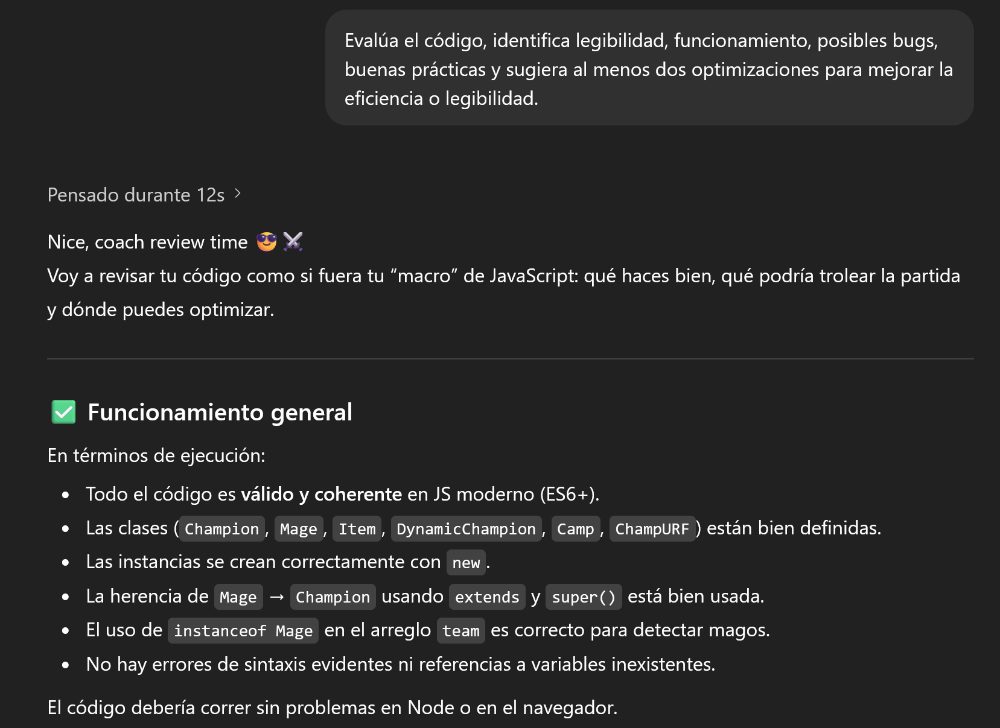

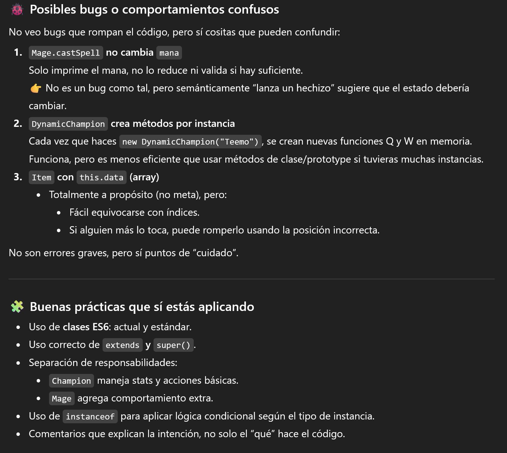


🚀 Sugerencias de optimización (mínimo 2, pero te doy varias)<br>

1️⃣ Optimización de eficiencia: evitar métodos creados en el constructor

### Actualmente:

```js
class DynamicChampion {
  constructor(name) {
    this.name = name;

    this.Q = () => {
      console.log(`${this.name} lanza su Q improvisada.`);
    };

    this.W = () => {
      console.log(`${this.name} activa su W defensiva.`);
    };
  }
}

```

🔴 Problema:
Cada instancia crea nuevas funciones Q y W en memoria. Si tuvieras 500 campeones dinámicos, tendrías 500 copias de cada método.

### Código optimizado 1️⃣:

```js
class DynamicChampion {
  constructor(name) {
    this.name = name;
  }

  Q() {
    console.log(`${this.name} lanza su Q improvisada.`);
  }

  W() {
    console.log(`${this.name} activa su W defensiva.`);
  }
}
```

Ahora:

- Q y W viven en el prototype.

- Todas las instancias comparten las mismas funciones → menos uso de memoria.

Puedes mantener la idea “no meta” en otra parte (como el uso de arrays en Item) y aquí quedarte con algo más óptimo.

---

2️⃣ Optimización de legibilidad: envolver las “demos” en funciones

Ahora mismo el archivo tiene una secuencia larga de código ejecutándose en el global.
Puede ser más legible si agrupas en funciones temáticas.

### Código optimizado 2️⃣:

```js
function demoChampions() {
  const ashe = new Champion("Ashe", "ADC", 95);
  const garen = new Champion("Garen", "Top", 120);

  ashe.showInfo();
  ashe.attack();

  garen.showInfo();
  garen.attack();

  console.log("====================================");
}

function demoMage() {
  const lux = new Mage("Lux", "Mid", 110, 400);
  lux.showInfo();
  lux.attack();
  lux.castSpell();
  console.log("====================================");
}

function demoTeam() {
  const team = [
    new Champion("Yasuo", "Mid", 130),
    new Champion("Jinx", "ADC", 100),
    new Champion("Leona", "Support", 60),
    new Mage("Veigar", "Mid", 105, 500),
  ];

  console.log("Equipo entrando a la Grieta:");
  team.forEach((champ) => {
    champ.showInfo();
    champ.attack();
    if (champ instanceof Mage) {
      champ.castSpell();
    }
  });
}

// Ejecutar demos:
demoChampions();
demoMage();
demoTeam();
```
Ventajas:

- Más fácil de leer por bloques.

- Puedes “comentar” una demo rápida sin tocar todo el código.

- Se ve más ordenado si alguien más lo revisa. 

---
3️⃣ Optimización de claridad: usar objetos en lugar de arrays para Item (opcional)

Sabemos que el uso de arrays fue adrede para ilustrar algo “no estándar”.
Pero puedes mostrar ambas versiones y así enseñar por qué lo no meta complica la vida.

### Código optimizado 3️⃣:

```js
class BetterItem {
  constructor(name, price) {
    this.name = name;
    this.price = price;
  }

  show() {
    console.log(`Ítem: ${this.name} | Costo: ${this.price} de oro`);
  }

  updatePrice(newPrice) {
    this.price = newPrice;
    console.log(`Nuevo precio de ${this.name}: ${this.price} de oro`);
  }
}
```

Usando primero el cambio numero 1 y el numero 3, se destacó con un bloque de comentario dónde está el cambio. El código quedó de la siguiente forma:

```js
// ================================
// 1) Clase básica: Campeón genérico
// ================================
// Piensa en esto como el "diseño base" de un campeón que haría Riot.

class Champion {
  constructor(name, role, damage) {
    // Stats base del campeón
    this.name = name;   // Nombre del campeón
    this.role = role;   // Rol (Mid, Top, ADC, Support, Jungle)
    this.damage = damage; // Daño base en autoataque
  }

  // Habilidad básica: auto ataque
  attack() {
    console.log(`${this.name} ataca y hace ${this.damage} de daño básico.`);
  }

  // Método para mostrar info del campeón
  showInfo() {
    console.log(`Campeón: ${this.name} | Rol: ${this.role} | Daño: ${this.damage}`);
  }
}

// ================================
// 2) Instancias: campeones en la grieta
// ================================
// Cada 'new Champion(...)' es como entrar a una partida con ese campeón.

const ashe = new Champion("Ashe", "ADC", 95);
const garen = new Champion("Garen", "Top", 120);

ashe.showInfo();   // Ashe en partida
ashe.attack();

garen.showInfo();  // Garen en partida
garen.attack();

console.log("====================================");

// ================================
// 3) Herencia: Mago que hereda de Champion
// ================================
// Como Lux/Veigar que comparten lógica de "magos" pero con cosas extra.

class Mage extends Champion {
  constructor(name, role, damage, mana) {
    // Llamamos al constructor de Champion (campeón base)
    super(name, role, damage);
    this.mana = mana; // Recurso extra para magos
  }

  castSpell() {
    console.log(`${this.name} lanza un hechizo y gasta mana. Mana actual: ${this.mana}`);
  }
}

const lux = new Mage("Lux", "Mid", 110, 400);
lux.showInfo();
lux.attack();
lux.castSpell();

console.log("====================================");

// ================================
// 4) Ejemplo NO META #1:
//    Clase de Ítems usando array en lugar de propiedades con nombre
// ================================
// Esto es como hacer una build troll: funciona, pero no es la forma estándar.
// En lugar de this.name y this.price, usamos this.data[0] y this.data[1].

//=================================
// LEGACY, CAMBIO HECHO POR CHAT
//=================================

/*

class Item {
  constructor(name, price) {
    // Guardamos todo en un solo array
    this.data = [name, price];
  }

  show() {
    // data[0] = nombre, data[1] = precio
    console.log(`Ítem: ${this.data[0]} | Costo: ${this.data[1]} de oro`);
  }

  // Podemos incluso simular "actualizar precio"
  updatePrice(newPrice) {
    this.data[1] = newPrice;
    console.log(`Nuevo precio de ${this.data[0]}: ${this.data[1]} de oro`);
  }
}
*/

//NUEVO USO

class Item {
  constructor(name, price) {
    this.name = name;
    this.price = price;
  }

  show() {
    console.log(`Ítem: ${this.name} | Costo: ${this.price} de oro`);
  }

  updatePrice(newPrice) {
    this.price = newPrice;
    console.log(`Nuevo precio de ${this.name}: ${this.price} de oro`);
  }
}

const potion = new Item("Poción de Vida", 50);
potion.show();
potion.updatePrice(60);

console.log("====================================");

// ================================
// 5) Ejemplo NO META #2:
//    Crear habilidades dinámicas dentro del constructor (Q, W, E, R)
// ================================
// Esto es como si crearas las skills del campeón "al vuelo".

//=================================
// LEGACY, CAMBIO HECHO POR CHAT
//=================================

/*
class DynamicChampion {
  constructor(name) {
    this.name = name;

    // Habilidad Q creada dinámicamente
    this.Q = () => {
      console.log(`${this.name} lanza su Q improvisada.`);
    };

    // Habilidad W creada dinámicamente
    this.W = () => {
      console.log(`${this.name} activa su W defensiva.`);
    };
  }
}
*/

//CAMBIO ACTUAL

class DynamicChampion {
  constructor(name) {
    this.name = name;
  }

  Q() {
    console.log(`${this.name} lanza su Q improvisada.`);
  }

  W() {
    console.log(`${this.name} activa su W defensiva.`);
  }
}

const teemo = new DynamicChampion("Teemo");
teemo.Q();
teemo.W();

console.log("====================================");

// ================================
// 6) Ejemplo NO META #3:
//    Clase sin constructor (como jugar sin jungla pero aún hay juego)
// ================================

class Camp {
  shout() {
    console.log("Soy un campamento neutral y existo sin constructor.");
  }
}

const blueBuff = new Camp();
blueBuff.shout();

console.log("====================================");

// ================================
// 7) Ejemplo NO META #4:
//    Clase casi vacía + prototype (estilo URF descontrolado)
// ================================
// Creamos la clase sin nada especial...

class ChampURF {}

// ...y luego le agregamos habilidades usando prototype:
ChampURF.prototype.Q = function () {
  console.log("Q spameada con 80% de CDR en URF.");
};

ChampURF.prototype.R = function () {
  console.log("R global sin cooldown aparente.");
};

const sonaURF = new ChampURF();
sonaURF.Q();
sonaURF.R();

console.log("====================================");

// ================================
// 8) Pequeña demo final: "equipo completo"
// ================================

const team = [
  new Champion("Yasuo", "Mid", 130),
  new Champion("Jinx", "ADC", 100),
  new Champion("Leona", "Support", 60),
  new Mage("Veigar", "Mid", 105, 500),
];

console.log("Equipo entrando a la Grieta:");
team.forEach((champ) => {
  champ.showInfo();
  champ.attack();

  // Si el campeón también es mago, que lance un hechizo
  if (champ instanceof Mage) {
    champ.castSpell();
  }
});
```
---

Al implementar el 2do cambio sugerido se modificó la forma de ejecutar una demo quedando ese bloque de código de la siguiente forma (actual vs cambio):

```js
// ================================
// 8) Pequeña demo final: "equipo completo"
// ================================

//=================================
// LEGACY, CAMBIO HECHO POR CHAT
//=================================
 /*
const team = [
  new Champion("Yasuo", "Mid", 130),
  new Champion("Jinx", "ADC", 100),
  new Champion("Leona", "Support", 60),
  new Mage("Veigar", "Mid", 105, 500),
];

console.log("Equipo entrando a la Grieta:");
team.forEach((champ) => {
  champ.showInfo();
  champ.attack();

  // Si el campeón también es mago, que lance un hechizo
  if (champ instanceof Mage) {
    champ.castSpell();
  }
});

*/

// ======================================================
// ==== CAMBIO #2: DEMOSTRACIONES ORGANIZADAS EN FUNCIONES
// ======================================================

// ----------------------------
// DEMO 1: Campeones básicos
// ----------------------------
function demoChampions() {
  separator();
  console.log("DEMO: Campeones básicos");

  const ashe = new Champion("Ashe", "ADC", 95);
  const garen = new Champion("Garen", "Top", 120);

  ashe.showInfo();
  ashe.attack();

  garen.showInfo();
  garen.attack();
}

// ----------------------------
// DEMO 2: Magos con herencia
// ----------------------------
function demoMage() {
  separator();
  console.log("DEMO: Mago (herencia)");

  const lux = new Mage("Lux", "Mid", 110, 400);
  lux.showInfo();
  lux.attack();
  lux.castSpell();
}

// ----------------------------
// DEMO 3: Items NO META
// ----------------------------
function demoItems() {
  separator();
  console.log("DEMO: Ítems no meta (arrays)");

  const potion = new Item("Poción de Vida", 50);
  potion.show();
  potion.updatePrice(60);
}

// ----------------------------
// DEMO 4: Campeón dinámico
// ----------------------------
function demoDynamicChampion() {
  separator();
  console.log("DEMO: Campeón dinámico");

  const teemo = new DynamicChampion("Teemo");
  teemo.Q();
  teemo.W();
}

// ----------------------------
// DEMO 5: Clase sin constructor
// ----------------------------
function demoCamp() {
  separator();
  console.log("DEMO: Campamento neutral");

  const blueBuff = new Camp();
  blueBuff.shout();
}

// ----------------------------
// DEMO 6: URF
// ----------------------------
function demoURF() {
  separator();
  console.log("DEMO: Campeón URF");

  const sonaURF = new ChampURF();
  sonaURF.Q();
  sonaURF.R();
}

// ----------------------------
// DEMO 7: Equipo completo
// ----------------------------
function demoTeam() {
  separator();
  console.log("DEMO: Equipo entrando a la Grieta");

  const team = [
    new Champion("Yasuo", "Mid", 130),
    new Champion("Jinx", "ADC", 100),
    new Champion("Leona", "Support", 60),
    new Mage("Veigar", "Mid", 105, 500),
  ];

  team.forEach((champ) => {
    champ.showInfo();
    champ.attack();

    if (champ instanceof Mage) {
      champ.castSpell();
    }
  });
}

// ================================
// EJECUCIÓN DE TODAS LAS DEMOS
// ================================
demoChampions();
demoMage();
demoItems();
demoDynamicChampion();
demoCamp();
demoURF();
demoTeam();
```
---

## 🎨 Fase 4 — Presentación y colaboración
*Usa la IA Generativa (prompts de imagen, diagramas de código como Mermaid/Graphviz) para crear un esquema visual, diagrama o infografía que explique la parte más compleja o inusual de tu solución a un público no técnico.*


🧩 1. Relaciones entre clases (versión “LoL” para no técnicos)

### Diagrama mermaid 1:

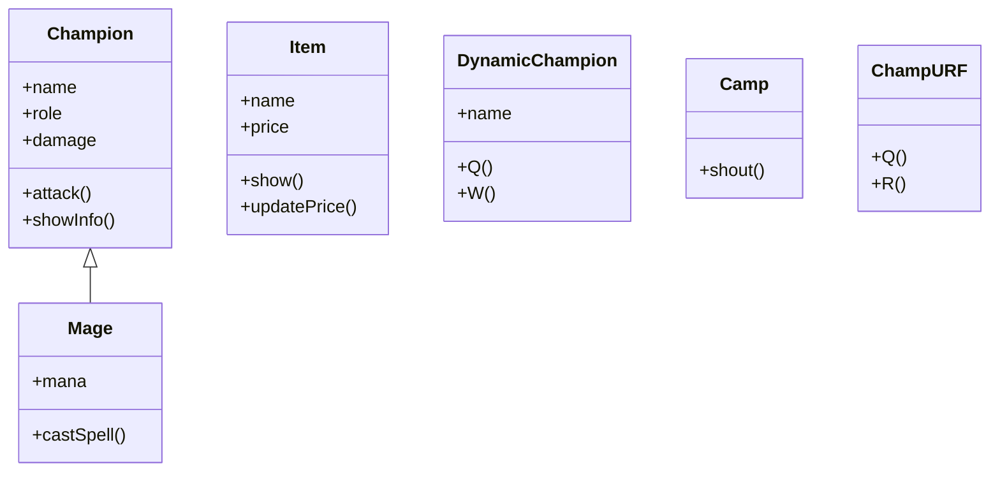

#### Cómo explicarlo a alguien no técnico:

- Champion
  Es como el diseño básico de un campeón en un juego:

  - Tiene nombre, rol y daño.
  - Puede atacar y mostrar su información.

- Mage hereda de Champion
  Es como una versión especializada de un campeón:

  - Además de lo anterior, tiene mana y puede lanzar hechizos.
  - En el diagrama, la flecha Champion <|-- Mage significa “Mage es un tipo de Champion”.

- Item
  Representa un objeto del juego:
  - Tiene nombre y precio.
  - Se puede mostrar y actualizar su precio.

- DynamicChampion
  Es un campeón que tiene habilidades definidas dentro del propio diseño:
  - Métodos Q() y W() ya definidos, listos para usarse.

- Camp
  Es algo simple: un campamento neutral que solo puede “gritar” que existe.

- ChampURF
  -  Es una clase casi vacía a la que luego se le pegan habilidades (Q y R) usando un mecanismo más antiguo (prototype).

  -  Es la parte “inusual”: mezcla el estilo moderno (class) con el estilo tradicional de JavaScript.

---

### 🔁 2. Flujo general de ejecución (las “demos” organizadas) - Diagrama mermaid 2:

```mermaid
La otra parte poco común (pero muy limpia) es que no ejecutas todo “tirado” en el archivo, sino que lo organizas en funciones demo que se llaman al final:

flowchart TD
    A[Ejecutar archivo JS] --> B[demoChampions()]
    B --> C[demoMage()]
    C --> D[demoItems()]
    D --> E[demoDynamicChampion()]
    E --> F[demoCamp()]
    F --> G[demoURF()]
    G --> H[demoTeam()]

    subgraph Demos
        B
        C
        D
        E
        F
        G
        H
    end
```

En resumen esto puede verse de la siguiente forma:

### Diagrama generado a partir de los dos anteriores:
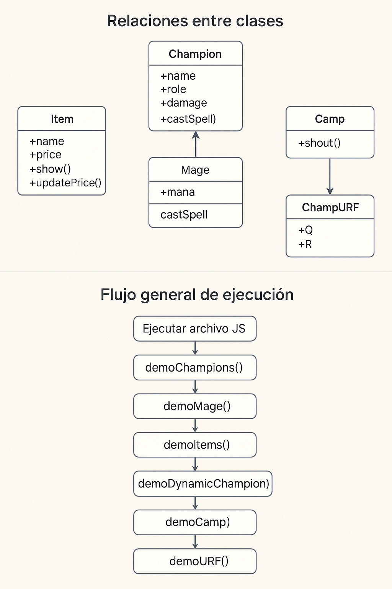

---

## CONCLUSIONES:
